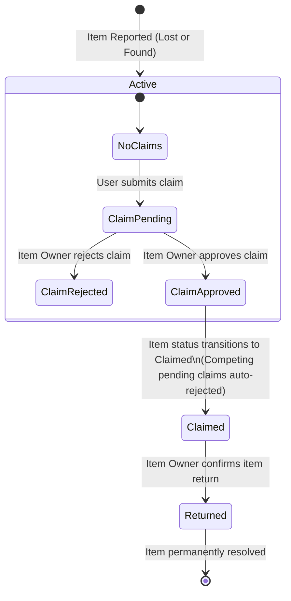

# Lost & Found RESTful API

[](https://dotnet.microsoft.com/)
[](https://learn.microsoft.com/en-us/dotnet/csharp/)
[](https://learn.microsoft.com/en-us/ef/core/)
[](https://blog.cleancoder.com/uncle-bob/2012/08/13/the-clean-architecture.html)
[]()
[](https://scalar.com/)
[-brightgreen)]()

A production-grade, portfolio-ready **Lost & Found Web API** built with **ASP.NET Core .NET 9**, implementing **Clean Architecture**, **CQRS (MediatR)**, **Repository + Unit of Work**, **ASP.NET Core Identity with JWT Authentication**, **FluentValidation**, **Serilog structured logging**, and **Scalar OpenAPI documentation**.

---

## Table of Contents

- [The Problem & Solution](#the-problem--solution)
- [Architecture & Tech Stack](#architecture--tech-stack)
- [System Architecture & Layers](#system-architecture--layers)
- [Business Workflows & State Machine](#business-workflows--state-machine)
- [Core Features](#core-features)
  - [1. Authentication & Role-Based Authorization](#1-authentication--role-based-authorization)
  - [2. Item Management](#2-item-management)
  - [3. Claim & Return Workflow](#3-claim--return-workflow)
  - [4. Lost & Found Matching Algorithm](#4-lost--found-matching-algorithm)
  - [5. Secure Image Upload Service](#5-secure-image-upload-service)
  - [6. Quality, Validation & Resilience](#6-quality-validation--resilience)
- [API Endpoints Reference](#api-endpoints-reference)
- [Getting Started & Local Setup](#getting-started--local-setup)
- [Configuration & Environment Variables](#configuration--environment-variables)
- [Database Migrations & Seed Data](#database-migrations--seed-data)
- [Running Automated Tests](#running-automated-tests)
- [Example Requests (cURL)](#example-requests-curl)
- [Scalar Interactive API Reference](#scalar-interactive-api-reference)

---

## The Problem & Solution

Lost and found operations in public venues, universities, airports, and transport hubs often rely on disorganized spreadsheets or physical desks. This causes three recurring problems:
1. **Inefficient Item Recovery**: Finding matches between lost item reports and turned-in items is slow, manual, and error-prone.
2. **Fraud & Unauthorized Ownership Claims**: Without strict verification and claim state management, items are vulnerable to fraudulent or duplicate claims.
3. **Security Vulnerabilities**: File upload endpoints in community portals often expose servers to malware, spoofed MIME headers, path traversal, and mass assignment attacks.

### The Solution

This API provides a centralized, secure platform that:
- Employs a **heuristic multi-factor matching engine** that scores potential item pairs based on category match, location token overlap, temporal proximity, and text similarity.
- Enforces a **strict state machine** for claims and item status transitions (`Active` &rarr; `Claimed` &rarr; `Returned`), preventing duplicate claims, self-claims, or unauthorized status mutations.
- Features an **enterprise-grade image upload pipeline** with magic number byte inspection, file size limits, extension whitelisting, and GUID sanitization.

---

## Architecture & Tech Stack

| Component | Technology | Description |
| :--- | :--- | :--- |
| **Framework** | ASP.NET Core .NET 9 | High-performance, modern cross-platform web framework |
| **Language** | C# 13 | Modern language features (primary constructors, pattern matching, records) |
| **Architecture** | Clean Architecture | Strict separation of Concerns across 4 isolated projects |
| **Design Pattern** | CQRS + MediatR | Decoupled commands, queries, and notification handlers |
| **Persistence** | Entity Framework Core 9 | Code-first ORM with SQL Server LocalDB / Azure SQL |
| **Security** | ASP.NET Core Identity + JWT | Token-based auth with Role claims (`Admin`, `User`) |
| **Validation** | FluentValidation | Expressive, strongly typed input validation pipelines |
| **Logging** | Serilog | Structured console and file logging with contextual enrichment |
| **Documentation** | Scalar + OpenAPI | Modern, interactive API documentation UI |
| **Testing** | xUnit + FluentAssertions + Moq | 72 automated unit, rule, security, and integration tests |

---

## System Architecture & Layers

The solution adheres strictly to Uncle Bob's **Clean Architecture** principles:

```text
LostAndFound.sln
│
├── src/
│   ├── LostAndFound.Domain/             # Enterprise Core (Zero Dependencies)
│   │   ├── Entities/                    # User, Item, Claim, Category
│   │   └── Enums/                       # ItemType, ItemStatus, ClaimStatus
│   │
│   ├── LostAndFound.Application/        # Application Business Rules
│   │   ├── Common/                      # Interfaces, Options, Models (Result, PaginatedList)
│   │   ├── Features/                    # CQRS Features (Auth, Items, Claims, Matching)
│   │   └── Services/                    # MatchingService & Scoring Engine
│   │
│   ├── LostAndFound.Infrastructure/     # External Concerns & Implementations
│   │   ├── Auth/                        # JwtService & Token generation
│   │   ├── FileStorage/                 # LocalFileService (Magic number validation)
│   │   ├── Persistence/                 # ApplicationDbContext, Repositories, UnitOfWork
│   │   └── Seed/                        # DbInitializer (Roles, Categories, Admin)
│   │
│   └── LostAndFound.API/                # Presentation Layer (Entry Point)
│       ├── Controllers/                 # ApiControllerBase, Auth, Items, Claims, Admin
│       ├── Middleware/                  # GlobalExceptionHandlingMiddleware
│       └── Services/                    # CurrentUserService (ClaimsPrincipal extraction)
│
└── tests/
    └── LostAndFound.Tests/              # Automated Test Suite (72 Tests)
        ├── Authentication/              # Auth handlers, token generation, ownership policies
        ├── Claims/                      # Claim workflows, duplicate defense, state transitions
        ├── FileUpload/                  # Magic bytes, extension, size, path traversal defenses
        ├── Items/                       # Creation, status protection, validation
        ├── Matching/                    # Scoring formula, weights, thresholds, order
        ├── Common/                      # Pagination clamping, query filtering
        └── Integration/                 # E2E WebApplicationFactory workflow tests
```

### Dependency Flow

$$\text{Domain} \longleftarrow \text{Application} \longleftarrow \text{Infrastructure} \longleftarrow \text{API}$$

All business rules live in `LostAndFound.Application` and depend only on abstractions. Database queries, authentication tokens, and disk operations are deferred to `LostAndFound.Infrastructure`.

---

## Business Workflows & State Machine



### Business Rules & Invariants
- **Self-Claim Prevention**: A user cannot submit a claim on their own item ($400\text{ Bad Request}$).
- **Active-Only Claiming**: Claims can only be created for items in `Active` status.
- **Single Pending Claim**: A user can have at most one `Pending` claim per item.
- **Approval Cascade**: When an item's owner approves a claim, that claim becomes `Approved`, the item transitions to `Claimed`, and all other pending claims for that item are automatically marked `Rejected`.
- **Return Verification**: Only the item's owner can mark a `Claimed` item as `Returned`.

---

## Core Features

### 1. Authentication & Role-Based Authorization
- **Registration**: Auto-assigns the `User` role. Email uniqueness is verified.
- **Login**: Verifies credentials and generates a signed JWT token containing standard claims (`sub`, `email`, `jti`, `uid`) and role claims.
- **Ownership Verification**: Resource-based checks guarantee that users can only modify, delete, or review claims for items they created (Admins bypass ownership checks).

### 2. Item Management
- **Item Types**: `Lost` (items lost by user) or `Found` (items found and turned in).
- **Server-Controlled Status**: Clients cannot directly set an item's status to `Claimed` or `Returned` during creation or updates. Status changes are strictly driven by the claims workflow.
- **Filtering & Pagination**: Public endpoints support filtering by `type`, `categoryId`, `status`, `searchTerm`, `dateFrom`, and `dateTo`, with safe page size clamping ($1 \le \text{PageSize} \le 50$).

### 3. Claim & Return Workflow
- Claimants provide a detailed description and optional contact information.
- Item owners inspect incoming claims (`GET /api/claims/item/{itemId}`).
- One-click approval (`POST /api/claims/{id}/approve`) executes an atomic transaction that marks the claim `Approved`, rejects other pending claims, and marks the item `Claimed`.
- Return confirmation (`POST /api/items/{id}/return`) transitions the item to `Returned`.

### 4. Lost & Found Matching Algorithm
A deterministic, multi-factor scoring engine pairs opposite-type items (`Lost` $\leftrightarrow$ `Found`) based on:

$$\text{Total Score} = \min(100, S_{\text{category}} + S_{\text{location}} + S_{\text{date}} + S_{\text{title}} + S_{\text{desc}})$$

| Factor | Max Weight | Logic / Formula |
| :--- | :--- | :--- |
| **Category** | 25 pts | Exact category ID match |
| **Location** | 20 pts | Normalized string match (20 pts) or word token overlap (10 pts) |
| **Date Proximity** | 20 pts | Same date (20 pts), 1 day (18 pts), 2 days (15 pts), down to 6 days (3 pts) |
| **Title Similarity** | 20 pts | Blended token Jaccard & Containment similarity: $(J \times 0.6 + C \times 0.4) \times 20$ |
| **Description** | 15 pts | Token overlap and containment similarity: $(J \times 0.6 + C \times 0.4) \times 15$ |

Items scoring above the threshold (default $\ge 40$) are returned, sorted by `MatchScore DESC`, then `DateLostOrFound DESC`.

### 5. Secure Image Upload Service
- **Extension Whitelist**: `.jpg`, `.jpeg`, `.png`, `.webp`.
- **Magic Number Inspection**: Validates binary file headers (`FF D8 FF` for JPEG, `89 50 4E 47` for PNG, `52 49 46 46` for WEBP) to prevent malware masquerading as images.
- **Sanitized Storage**: Files are saved with GUID filenames to prevent path traversal and file collisions.
- **Capacity Controls**: Files are capped at 5 MB by default.
- **Dual Ingestion**: Supports both `multipart/form-data` during item creation/update and dedicated `POST /api/items/{id}/image` uploads.

### 6. Quality, Validation & Resilience
- **FluentValidation Pipeline**: Automatic validation before reaching CQRS handlers.
- **RFC 7807 Error Envelope**: Consistent error responses across all validation and business rule failures:
  ```json
  {
    "success": false,
    "message": "Validation failed.",
    "errors": [
      {
        "field": "title",
        "message": "Title is required."
      }
    ]
  }
  ```
- **Global Exception Handling**: Any unhandled exception is logged with full stack traces via Serilog and returned as a sanitized $500\text{ Internal Server Error}$ envelope.

---

## API Endpoints Reference

### Authentication (`/api/auth`)
| Method | Endpoint | Auth | Description | Status Codes |
| :--- | :--- | :--- | :--- | :--- |
| `POST` | `/api/auth/register` | Anonymous | Register a new user | `201`, `400`, `409` |
| `POST` | `/api/auth/login` | Anonymous | Authenticate and obtain JWT | `200`, `400`, `401` |
| `GET` | `/api/auth/me` | User | Get current user's profile and claims | `200`, `401` |

### Items (`/api/items`)
| Method | Endpoint | Auth | Description | Status Codes |
| :--- | :--- | :--- | :--- | :--- |
| `GET` | `/api/items` | Anonymous | Browse items with pagination & filters | `200` |
| `GET` | `/api/items/{id}` | Anonymous | Get detailed item information | `200`, `404` |
| `GET` | `/api/items/my` | User | Get items reported by current user | `200`, `401` |
| `POST` | `/api/items/lost` | User | Report a lost item (JSON or multipart) | `201`, `400`, `401` |
| `POST` | `/api/items/found` | User | Report a found item (JSON or multipart) | `201`, `400`, `401` |
| `PUT` | `/api/items/{id}` | Owner/Admin | Update item details (JSON or multipart) | `200`, `400`, `403`, `404` |
| `DELETE`| `/api/items/{id}` | Owner/Admin | Delete an item | `204`, `403`, `404` |
| `POST` | `/api/items/{id}/return` | Owner/Admin | Mark a claimed item as returned | `200`, `400`, `403`, `404` |
| `POST` | `/api/items/{id}/image` | Owner/Admin | Upload or replace item image | `200`, `400`, `403`, `404` |
| `DELETE`| `/api/items/{id}/image`| Owner/Admin | Remove item image | `204`, `403`, `404` |
| `GET` | `/api/items/{id}/matches`| Owner/Admin| Run matching algorithm for item | `200`, `400`, `403`, `404` |

### Claims (`/api/claims`)
| Method | Endpoint | Auth | Description | Status Codes |
| :--- | :--- | :--- | :--- | :--- |
| `POST` | `/api/claims` | User | Submit a claim on an active item | `201`, `400`, `401`, `404`, `409` |
| `GET` | `/api/claims/my` | User | Get claims submitted by current user | `200`, `401` |
| `GET` | `/api/claims/item/{itemId}`| Owner/Admin | Get all claims submitted for an item | `200`, `401`, `403`, `404` |
| `POST` | `/api/claims/{id}/approve` | Owner/Admin | Approve claim (cascades rejections) | `200`, `400`, `403`, `404` |
| `POST` | `/api/claims/{id}/reject` | Owner/Admin | Reject claim | `200`, `400`, `403`, `404` |

### Administration (`/api/admin`)
| Method | Endpoint | Auth | Description | Status Codes |
| :--- | :--- | :--- | :--- | :--- |
| `GET` | `/api/admin/ping` | Admin | Verify administrative role privileges | `200`, `401`, `403` |

---

## Getting Started & Local Setup

### Prerequisites
- [.NET 9.0 SDK](https://dotnet.microsoft.com/download/dotnet/9.0)
- [SQL Server](https://www.microsoft.com/sql-server/) (or SQL Server LocalDB included with Visual Studio)

### Step 1: Clone the Repository
```bash
git clone https://github.com/MoSayed335/LostAndFound.API.git
cd LostAndFound.API
```

### Step 2: Configure Settings
Development settings are pre-configured in `LostAndFound.API/appsettings.Development.json` using LocalDB:
```json
{
  "ConnectionStrings": {
    "DefaultConnection": "Server=(localdb)\\mssqllocaldb;Database=LostAndFoundDb;Trusted_Connection=True;MultipleActiveResultSets=true;TrustServerCertificate=True"
  },
  "Jwt": {
    "Key": "YourSuperSecretSigningKeyAtLeast32CharsLong!",
    "Issuer": "LostAndFoundAPI",
    "Audience": "LostAndFoundClient",
    "ExpiryMinutes": 120
  }
}
```

### Step 3: Run the Application
```bash
dotnet run --project LostAndFound.API
```

> **Note**: Database schema migrations and default seeds (roles, standard categories, and development admin) execute automatically on startup via `DbInitializer.SeedAsync`.

### Step 4: Open Interactive API Documentation
Once running, navigate to:
```text
https://localhost:7000/scalar/v1
```

---

## Configuration & Environment Variables

For production deployments, configure values via environment variables or secret vaults:

| Variable | Description | Example |
| :--- | :--- | :--- |
| `ConnectionStrings__DefaultConnection` | SQL Server connection string | `Server=tcp:sqlserver...` |
| `Jwt__Key` | Secret key for HMAC-SHA256 signing ($\ge 32$ chars) | `SuperSecureProductionKey!` |
| `Jwt__Issuer` | Token issuer | `LostAndFoundAPI` |
| `Jwt__Audience` | Token audience | `LostAndFoundClient` |
| `Jwt__ExpiryMinutes` | Token validity in minutes | `120` |
| `ImageUpload__MaxFileSizeInBytes` | Maximum file size allowed | `5242880` (5 MB) |
| `SeedAdmin__Email` | Initial system admin email | `admin@yourdomain.com` |
| `SeedAdmin__Password` | Initial system admin password | `Complex@P4ssw0rd!` |

---

## Database Migrations & Seed Data

### Applying Migrations Manually
```bash
dotnet ef database update --project LostAndFound.Infrastructure --startup-project LostAndFound.API
```

### Seed Data
The database automatically seeds:
- **Roles**: `Admin`, `User`
- **Categories**: `Electronics`, `Wallet`, `Keys`, `Documents`, `Bags`, `Clothing`, `Other`
- **Default Admin Account** (Development only):
  - **Email**: `admin@lostandfound.dev`
  - **Password**: `Admin@12345`

---

## Running Automated Tests

The solution contains a comprehensive test project (`LostAndFound.Tests`) covering unit, business logic, security, and integration workflows:

```bash
dotnet test
```

### Test Suite Breakdown (72 Total Tests)

```text
Passed!  - Failed: 0, Passed: 72, Skipped: 0, Total: 72
```

1. **`FileServiceTests` (8 tests)**: Extension whitelisting, magic byte inspection (JPEG/PNG/WEBP), disguised executable rejection, file size caps, path traversal defenses, deletion.
2. **`ClaimBusinessRuleTests` (7 tests)**: Self-claim prevention, inactive item claiming, duplicate pending claim defense, approval cascade logic, return state mutation.
3. **`ItemFeatureAndValidationTests` (15 tests)**: Server-controlled status protection, mass assignment defense, ownership boundaries, FluentValidation rules.
4. **`MatchingServiceTests` (10 tests)**: Heuristic scoring formula, individual factor weights, opposite-type enforcement, threshold filtering, secondary ordering.
5. **`AuthorizationPolicyTests` (14 tests)**: User vs Owner vs Admin permissions across edit, delete, view claims, approve claims, reject claims, return, and match endpoints.
6. **`AuthHandlerAndSecurityTests` (7 tests)**: Duplicate email rejection, password complexity, default role assignment, JWT claim encoding and validation.
7. **`PaginationAndFilterTests` (7 tests)**: Page size clamping, page count calculations, query filter predicates.
8. **`ApiWorkflowIntegrationTests` (4 tests)**: End-to-end `WebApplicationFactory` workflows (Register &rarr; Login &rarr; Authenticated Claim &rarr; Item creation &rarr; Public retrieval).

---

## Example Requests (cURL)

### 1. Register a User
```bash
curl -X POST https://localhost:7000/api/auth/register \
  -H "Content-Type: application/json" \
  -d '{
    "firstName": "John",
    "lastName": "Doe",
    "email": "john.doe@example.com",
    "password": "Password@123"
  }'
```

### 2. Login
```bash
curl -X POST https://localhost:7000/api/auth/login \
  -H "Content-Type: application/json" \
  -d '{
    "email": "john.doe@example.com",
    "password": "Password@123"
  }'
```

### 3. Report a Lost Item (JSON)
```bash
curl -X POST https://localhost:7000/api/items/lost \
  -H "Content-Type: application/json" \
  -H "Authorization: Bearer <YOUR_ACCESS_TOKEN>" \
  -d '{
    "title": "Black Dell XPS 15",
    "description": "Left near library desk on 2nd floor",
    "categoryId": 1,
    "location": "Main Campus Library Floor 2",
    "dateLostOrFound": "2026-09-24T10:00:00Z"
  }'
```

### 4. Search and Filter Items
```bash
curl -X GET "https://localhost:7000/api/items?type=Lost&categoryId=1&searchTerm=Dell&pageNumber=1&pageSize=10"
```

### 5. Find Matches for an Item
```bash
curl -X GET https://localhost:7000/api/items/1/matches \
  -H "Authorization: Bearer <YOUR_ACCESS_TOKEN>"
```

### 6. Submit a Claim
```bash
curl -X POST https://localhost:7000/api/claims \
  -H "Content-Type: application/json" \
  -H "Authorization: Bearer <CLAIMANT_ACCESS_TOKEN>" \
  -d '{
    "itemId": 1,
    "description": "It has an Intel Core i7 sticker and a small scratch on the bottom right.",
    "contactInfo": "claimant@example.com / 555-0199"
  }'
```

### 7. Approve a Claim (Item Owner or Admin)
```bash
curl -X POST https://localhost:7000/api/claims/1/approve \
  -H "Authorization: Bearer <OWNER_ACCESS_TOKEN>"
```

### 8. Mark Item as Returned
```bash
curl -X POST https://localhost:7000/api/items/1/return \
  -H "Authorization: Bearer <OWNER_ACCESS_TOKEN>"
```

---

## Scalar Interactive API Reference

Scalar provides an interactive, modern OpenAPI explorer. When running in `Development`, visit:

```text
https://localhost:7000/scalar/v1
```

- **Interactive Testing**: Test any endpoint directly from the browser.
- **JWT Authorization**: Click the **Authorize** button in Scalar and paste your token as `Bearer <token>` to authenticate requests.
- **Request & Response Samples**: Automatically generated code snippets for cURL, JavaScript, C#, Python, and more.

---

## License

This project is licensed under the [MIT License](LICENSE).
